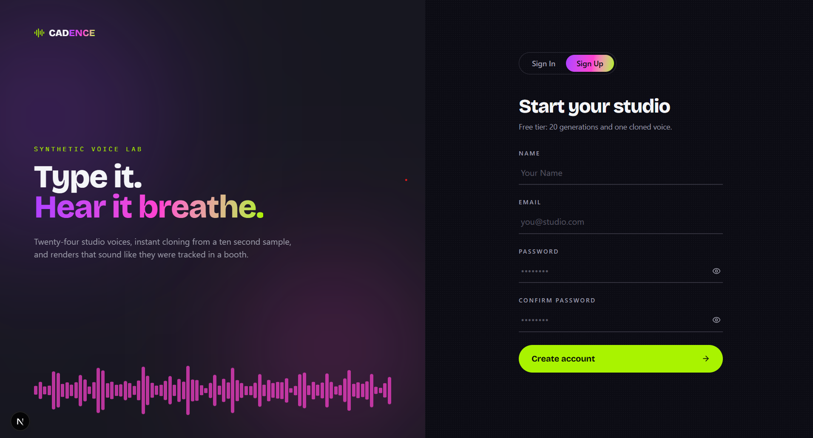
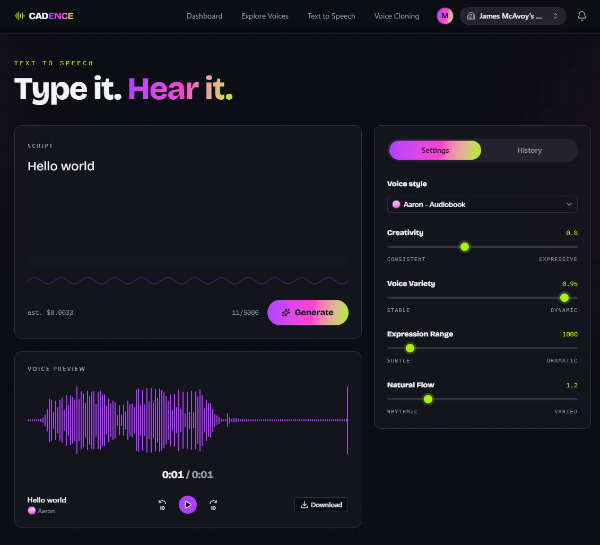

# Cadence

Cadence is a text-to-speech SaaS platform built on Next.js. It lets organizations generate natural-sounding speech from text using cloned or system voices, manage that audio, and collaborate across teams.

## Screenshots

| Sign up | Text to speech studio |
| --- | --- |
|  |  |

## Features

- **Text-to-speech generation** — turn text into speech using system voices or custom cloned voices, with fine-grained control over temperature, top-p, top-k, and repetition penalty.
- **Voice library** — system voices (seeded) and organization-owned custom voices, categorized by use case (audiobook, conversational, customer service, narrative, podcast, and more).
- **Organizations & collaboration** — personal orgs, org switching, member invites, and an in-app notification feed for events like invitations.
- **Audio storage & playback** — generated audio is stored in S3-compatible object storage and streamed back for playback and download.
- **Authentication** — email/password auth with email verification and password reset, backed by Neon Auth.

## Tech stack

- **Framework:** [Next.js](https://nextjs.org) (App Router) with React 19 and TypeScript
- **API layer:** [tRPC](https://trpc.io) with TanStack Query
- **Database:** PostgreSQL via [Neon](https://neon.tech), [Drizzle ORM](https://orm.drizzle.team) for schema and migrations
- **Auth:** [Neon Auth](https://neon.tech/docs/guides/auth) (`@neondatabase/auth`)
- **Object storage:** S3-compatible storage via `@aws-sdk/client-s3`
- **TTS engine:** [Chatterbox](https://github.com/resemble-ai/chatterbox) voice-cloning model, served from a [Modal](https://modal.com) endpoint (`chatterbox_tts.py`)
- **UI:** Tailwind CSS, Radix UI / shadcn-based components, `wavesurfer.js` for waveform playback
- **Error monitoring:** [Sentry](https://sentry.io) *(planned)*
- **Billing:** [Polar](https://polar.sh) and [Stripe](https://stripe.com) *(planned)*

## Getting started

### Prerequisites

- Node.js 20+
- pnpm (this repo uses a `pnpm-workspace.yaml` / `pnpm-lock.yaml`)
- A PostgreSQL database (e.g. a [Neon](https://neon.tech) project)
- A Neon Auth project for authentication
- An S3-compatible bucket for audio/voice storage
- A deployed Chatterbox TTS endpoint (see `chatterbox_tts.py`)

### Setup

1. Install dependencies:

   ```bash
   pnpm install
   ```

2. Copy the environment template and fill in your values:

   ```bash
   cp .env.example .env
   ```

   Required environment variables (see `lib/env.ts`):

   | Variable | Description |
   | --- | --- |
   | `DB_URL` | PostgreSQL connection string |
   | `NEON_AUTH_BASE_URL` | Neon Auth base URL |
   | `NEON_AUTH_COOKIE_SECRET` | Secret used to sign Neon Auth session cookies |
   | `CHATTERBOX_API_URL` | URL of the deployed Chatterbox TTS endpoint |
   | `CHATTERBOX_API_KEY` | API key for the Chatterbox endpoint |
   | `S3_REGION` | Region of the S3 bucket used for audio/voice storage |
   | `S3_ACCESS_KEY_ID` | S3 access key ID |
   | `S3_SECRET_ACCESS_KEY` | S3 secret access key |
   | `S3_BUCKET_NAME` | Name of the S3 bucket |

3. Push the database schema and seed system voices:

   ```bash
   pnpm db:push
   pnpm db:seed
   ```

4. Run the development server:

   ```bash
   pnpm dev
   ```

   Open [http://localhost:3000](http://localhost:3000).

## Scripts

| Command | Description |
| --- | --- |
| `pnpm dev` | Start the Next.js dev server |
| `pnpm build` | Build for production |
| `pnpm start` | Run the production build |
| `pnpm lint` | Run ESLint |
| `pnpm db:generate` | Generate Drizzle migrations from schema changes |
| `pnpm db:migrate` | Apply Drizzle migrations |
| `pnpm db:push` | Push the current schema to the database |
| `pnpm db:studio` | Open Drizzle Studio |
| `pnpm db:seed` | Seed system voices |
| `pnpm sync-api` | Sync/generate API types (`scripts/sync-api.ts`) |

## Project structure

```
app/                  Next.js App Router pages and routes
  api/                Route handlers (auth, tRPC, audio streaming)
  auth/               Sign-in / sign-up
  dashboard/          Dashboard
  text-to-speech/     Text-to-speech studio (script, voice selection, settings)
trpc/                 tRPC router setup and procedures (generations, voices, organizations, notifications)
lib/
  auth/               Auth client/server config and organization helpers
  db/                 Drizzle schema and DB client
  constants/          Shared constants (voice categories, sliders, etc.)
  validations/        Zod validation schemas
  s3.ts               S3 client/helpers
  chatterbox-client.ts  Client for the Chatterbox TTS API
drizzle/              SQL migrations and schema snapshots
scripts/              One-off scripts (voice seeding, API sync)
chatterbox_tts.py     Modal app serving the Chatterbox TTS model
```

## Roadmap

- **Sentry** — error tracking and performance monitoring across the app.
- **Polar** — merchant-of-record billing and subscription management.
- **Stripe** — payment processing for plans/credits.

## Deployment

The easiest way to deploy this Next.js app is [Vercel](https://vercel.com). The Chatterbox TTS model is deployed separately as a [Modal](https://modal.com) app — see the setup instructions at the top of `chatterbox_tts.py`.
